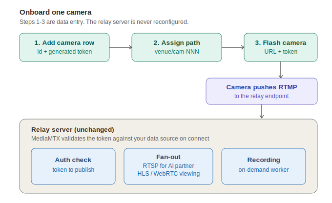

# mediamtx-camera-relay

A hosted Linux relay for venue cameras. Cameras push RTMP in; each feed is served as RTSP (for AI analysis), HLS/WebRTC (for phone and browser viewing over HTTPS), and on-demand recordings uploaded to cloud storage.

The design goal is effortless scale: **onboarding a new camera never touches the relay server.** Auth and routing are driven from a data source, so adding a camera is a data entry plus a device flash, not a config change or restart. Camera 200 is the same effort as camera 2.

## Per-camera onboarding

Adding a camera is three data steps plus plugging it in:

1. **Add a camera row** — a camera ID and an auto-generated publish token, written to the data source. No server restart.
2. **Assign a stream path** — a unique path such as `venue-name/cam-207`, following a fixed naming convention so paths never collide.
3. **Flash the camera** — preconfigure it with the single relay endpoint (`rtmp://relay.example.com/venue-name/cam-207`) and its token.

Plug it in. The camera pushes RTMP to the shared endpoint, MediaMTX validates the token against the data source on connect, and the feed goes live and fans out automatically to RTSP, HLS/WebRTC, and the on-demand recording worker. No new server config, no restart, no per-camera server work.

The same "add a row" step can be driven by an API or provisioning script, making onboarding a single call.

## Stack

- **MediaMTX** as the core relay (RTMP in; RTSP, HLS, WebRTC out).
- **FFmpeg** stream-copy for on-demand recording (no transcoding).
- **Cloudflare R2 or S3** for recordings, with lifecycle expiry.
- **Caddy or Nginx** for HTTPS in front of the live and replay endpoints.
- **Linux** with systemd, firewall, and locked-down ports.
